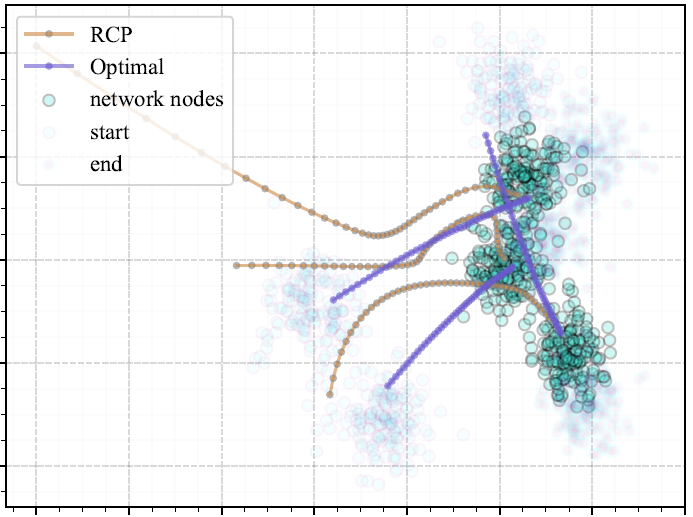

# dynamic_sdn
A Temporal Clustering Algorithm for Software Defined Networks 

This repository provides facilities for synthesizing Gaussian dynamic
 data for Dynamic Controller Placement in Software Defined Networks and also 
 placing controllers in the mobile telecommunication network using RCP algorithm.